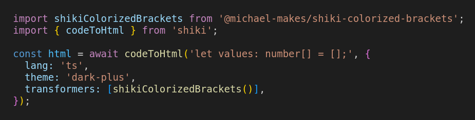

# shiki-colorized-brackets

VSCode-style colorized brackets for [Shiki](https://shiki.style)

# Basic Usage

Install:
```bash
# npm (use any of npx, yarn dlx, pnpm dlx, or bunx)
npx jsr add @michael-makes/shiki-colorized-brackets

# deno
deno add @michael-makes/shiki-colorized-brackets
```

Add to your Shiki transformers:
```ts
import shikiColorizedBrackets from '@michael-makes/shiki-colorized-brackets';
import { codeToHtml } from 'shiki';

const html = await codeToHtml('let values: number[] = [];', {
  lang: 'ts',
  theme: 'dark-plus',
  transformers: [shikiColorizedBrackets()],
});
```

Here's an example of what the above code looks like when highlighted with shiki-colorized-brackets:



# Config

## Colors

Brackets are automatically colored according to your Shiki theme (or themes if using [dual themes](https://shiki.style/guide/dual-themes)), with support for all of Shiki's built-in themes. However, you can customize colors if you've added custom themes to Shiki, or if you want to override the colors of a built-in theme:

```ts
const html = await codeToHtml('let values: number[] = [];', {
  lang: 'ts',
  theme: myCustomTheme,
  transformers: [shikiColorizedBrackets({
    themes: {
      'my-custom-theme': ['goldenrod', 'blueviolet', 'dodgerblue', 'crimson'],
    },
  })],
});
```

The final color is the mismatched bracket color. The other colors are for each "level" of bracket pair. Any valid CSS color can be used.

If no bracket colors are found for a theme, it falls back to the default `dark-plus` theme.

## Brackets

You can customize the bracket pairs:

```ts
const transformer = shikiColorizedBrackets({
  bracketPairs: [{ opener: '{', closer: '}' }],
});
```

The above would only colorize `{}` curly brackets. The default config colorizes `[]` square brackets, `{}` curly brackets, `()` parentheses, and `<>` angle brackets (only in TS type annotations).

For advanced usage, you can specify which TextMate scopes a bracket pair is allowed or denied in, using `scopesAllowList` and `scopesDenyList`. For example, the default config for `<>` angle brackets is:

```ts
{
  opener: "<",
  closer: ">",
  scopesAllowList: [
    "punctuation.definition.typeparameters.begin.ts",
    "punctuation.definition.typeparameters.end.ts",
  ],
}
```

## Language-specific Overrides

All settings can be overridden for specific languages using the `langs` option:

```ts
const transformer = shikiColorizedBrackets({
  langs: { ts: myCustomTypescriptConfig },
});
```

# Development

```bash
bun install
```

To run tests:

```bash
bun test
```

## Writing Tests

`tests/samples` contains code snippets that annotate expected colors with `@colors` comments. `Y`, `P`, `B` are for the 3 levels of matched brackets (yellow, purple, blue), and `R` is for mismatched brackets (red). Values before `@colors` indicate the expected color of the bracket on the preceding line. Values after `@colors` are explicitly indexed. For example:

```ts
function first<T>(array: T[]) {
  //          Y YY        PPY Y @colors
  return array[0];
  //          P P @colors
}
// @colors 0=Y
```

In the final line, there's not room underneath the `}` to annotate the color, so an explicit index `0=Y` is used after `@colors`.
